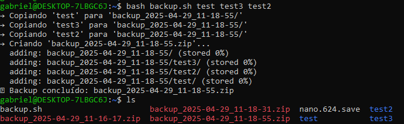

# Explicação do Script de Backup - Exercício 1

Script automatiza o processo de criação de um backup dos diretórios especificados. Tomei a liberdade de melhorar o código feito em aula, colocando em prática os conceitos que foram aprendidos e as referências disponibilizadas (utilização de IF principalmente e um pouco de "log" em formato de echo para acompanhar o processo).

1. **Nome do arquivo**:

- O arquivo é criado usando a data e hora atuais no formato `YYYY-MM-DD_HH-MM-SS`, dessa forma é possível diferenciar os backups feitos em momentos diferentes

2.**Criação do Diretório de Backup**:

- O script cria o diretório de backup caso ele ainda não exista e o apaga ao final da execução

## Uso referenciado na imagem

